# Trabajo Practico N°1 - Redes de Computadoras
### **Grupo:** LAN-gustia 
---
### Integrantes: 
* 
* 
* 
* 
* 
* 
---
###  Desarrollo

## 1.
## 2. 
## 3. 

## 4. Simulación en Cisco Packet Tracer 

### 4.a y 4.b - colocación y configuración del router

1. **Colocación del dispositivo:** Desde la categoría `network-devices > wireless-devices`, agregamos un router modelo **WRT300N** al área de trabajo.

2. **Configuración LAN:** configuramos la dirección IP para que sea `192.168.0.1` y `255.255.255.0` como máscara de subred.

3. **Configuración del SSID:** Le asignamos a la red el nombre del grupo LAN-gustia (SSID).

4. **Seguridad:** Configuramos la seguridad wireless para operar con **WPA2-PSK** con una contraseña de prueba (la que viene por default en algunos routers). 

---
### 4.c Analisis de las configs del router

Podemos ver desde las configuraciones del mismo router que la frecuencia por defecto a la que opera es de **2.4 Ghz**, que se puede apreciar en la siguiente imagen: 

En cuando a la región del espectro electromagnético a la que pertenece esta frecuencia podemos decir que forma parte de las **microondas**, y opera dentro de la banda **UHF** (Ultra Alta Frecuencia), específicamente en la banda no licenciada **ISM** (Industrial, Científica y Médica), que abarca el rango de 2.4 GHz a 2.5 GHz (2400 MHz a 2500 MHz).

---
### 4.d Conexión y configuración de la pc de escritorio 

1. **Colocación de la Pc de escritorio**

2. **Conexión fisica entre pc y router**

3. **Habilitación del DHCP** 

### 4.e. Instalacion de la NIC WI-Fi en la notebook

1. **Apagado de la notebook**

Primero es necesario apagar la notebook desde el boton fisico en la vista del dispositivo para poder modificar sus componenetes.

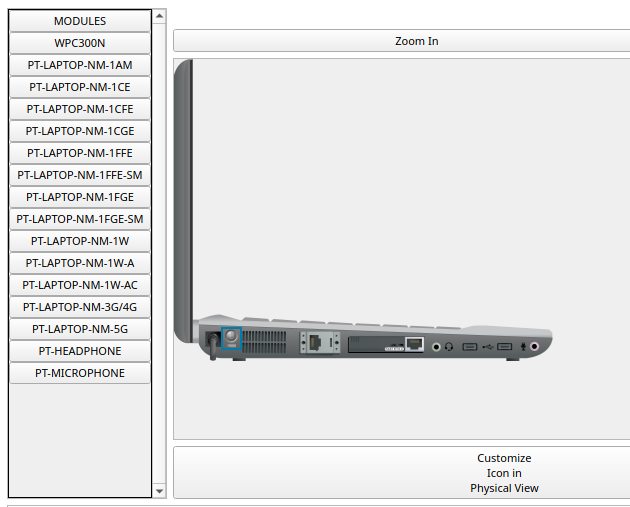

2. **Extraccion de la placa de red actual**

REtiramos la placa de red que viene por defecto en la ranura de expansion, arrastrandola hacia la columna de modulos a la izquierda.

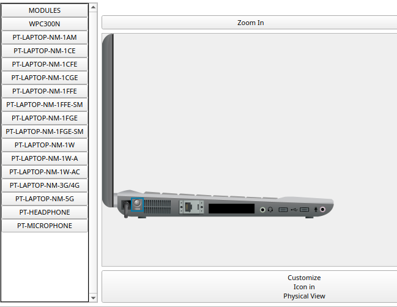

3. **Colocacion del modulo Wi-Fi (WPC300N)**

Seleccionamos el modulo **WPC300N** desde la lista de modulos, lo arrastramos hacia la aranura que liberamos y luego volvemos a encender la notebook.

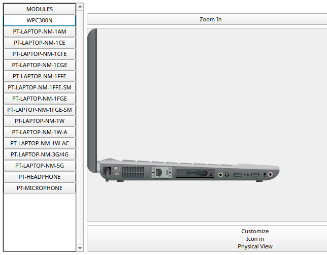

### 4.f. Conexion de la notebook a la red Wi-Fi

1. **Ingreso a la utilidad PC Wireless**

Dentro de las opciones de la notebook, vamos a la solapa **"Desktop"** (ubicada al lado de Config) y abrimos la aplicacion **"PC Wireless"**.

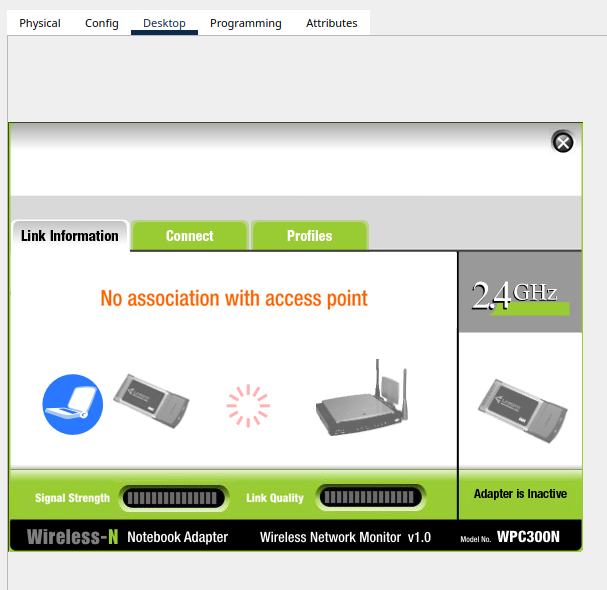

2. **Busqueda y conexion a la red**

Dentro de PC Wireless, nos dirigimos a la solapa connect. Esperamos a que aparezca la red inalambrica que configuramos, la seleccionamos y hacemos clic en conectar.

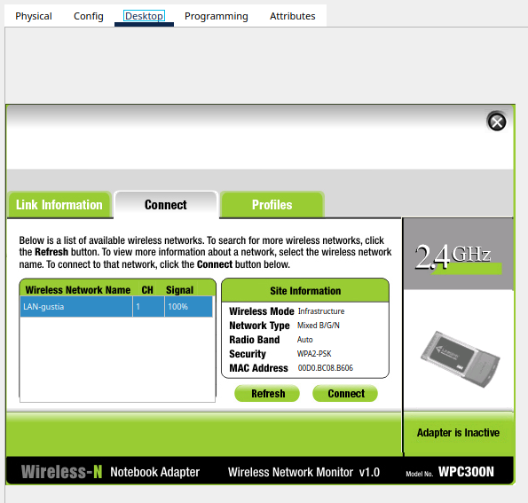

3. **Verificacion de la conexion ene l simulador**

UNa vez conectados exitosamente, al volver al area de trabjo principal, aparece un enlace (lineas punteadas) que representa la conexion inalambrica.

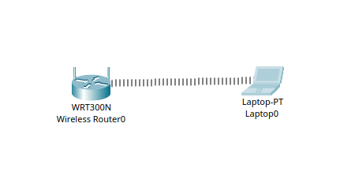

### 4.g. Verificacion de conectividad entre las computadoras

1. **Obtencion de IP en la PC de escritorio**

Desde el command Prompt de la PC de escritorio, ejecutamos el comando `ipconfig` para verificar la direccion IP asignada por DHCP, la cual es **192.168.0.102**.

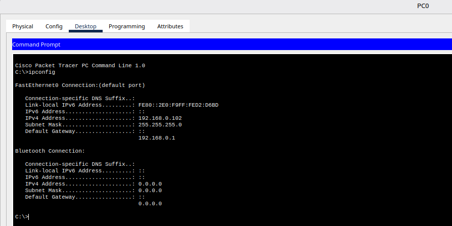

2. **Obtencion de IP de la notebook**

Con el mismo procedimiento obtenemos la direccion IP asignada por DHCP a la notebook, la cual es **192.168.0.101**.

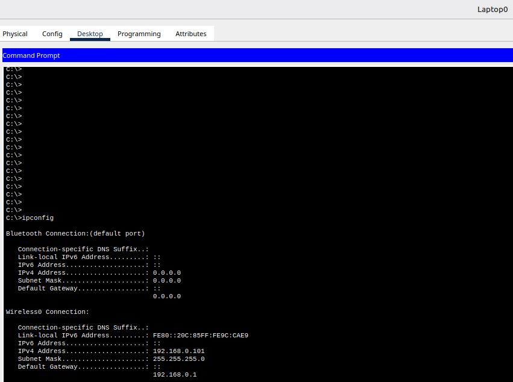

3. **Prueba de conectividad entre los equipos**

Desde la notebook enviamos un "ping" hacia la PC de escritorio, y desde la PC de escritorio realizamos un ping hacia la notebook. En ambos casos se recibieron correctamente los 4 paquetes sin ninguna perdida.

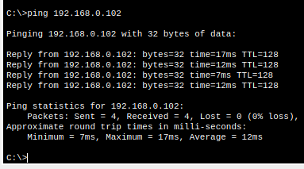
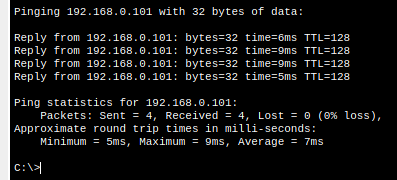

### 4.h. Analisis de la cobertura de la red Wi-Fi

1. **Ubicacion de la notebook en la posicion 1**

Movemos la notebook a una segunda habitacion u oficina, separada por paredes del router.

**Prueba ping:** Ejecutamos ping 192.168.0.102
**Resultado:** Se recibieron correctamente los 4 paquetes sin ninguna perdida, aunque se nota una leve disminucion en la calidad de la señal.

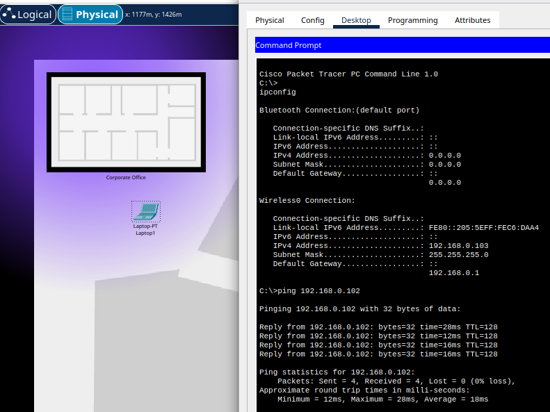

2. **Ubicacion de la notebook en la posicion 2**

Ubicamos la notebook en el punto mas alejado, atravesando varias paredes.
**Prueba ping:** Ejecutamos ping 192.168.0.102
**Resultado:** Se presentan perdidas de paquetes (mensajes de *Request timed out*), demostrando lad egradacion del enlace por atenuacion y distancia.

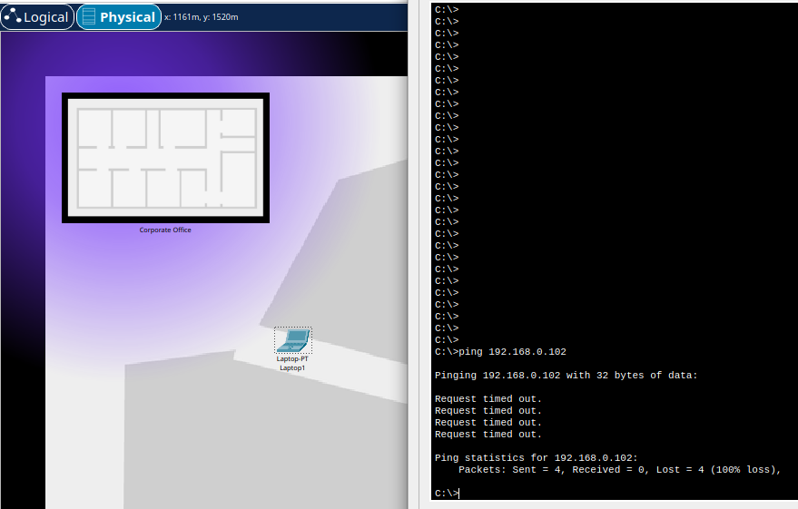
---