# Trabajo Practico N°1 - Redes de Computadoras
### **Grupo:** LAN-gustia 
---
### Integrantes: 
* 
* 
* 
* 
* 
* 
---
###  Desarrollo

## 1.
## 2. 
## 3. 

## 4. Simulación en Cisco Packet Tracer 

### 4.a y 4.b - colocación y configuración del router

1. **Colocación del dispositivo:** Desde la categoría `network-devices > wireless-devices`, agregamos un router modelo **WRT300N** al área de trabajo.

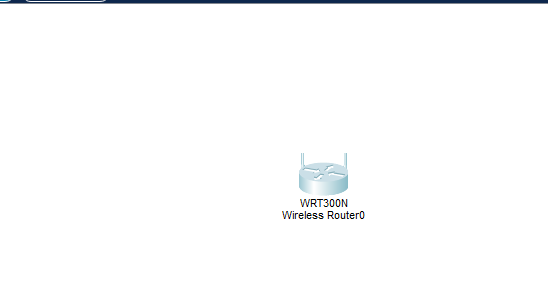
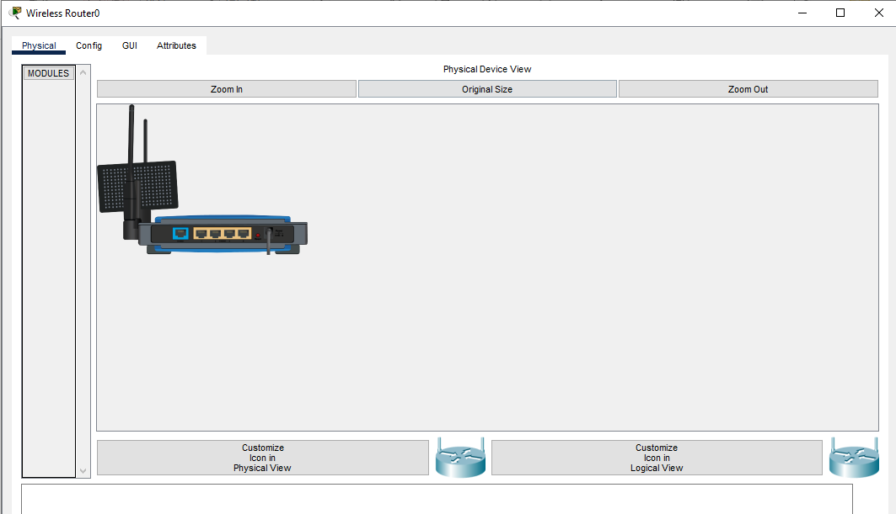

2. **Configuración LAN:** configuramos la dirección IP para que sea `192.168.0.1` y `255.255.255.0` como máscara de subred.

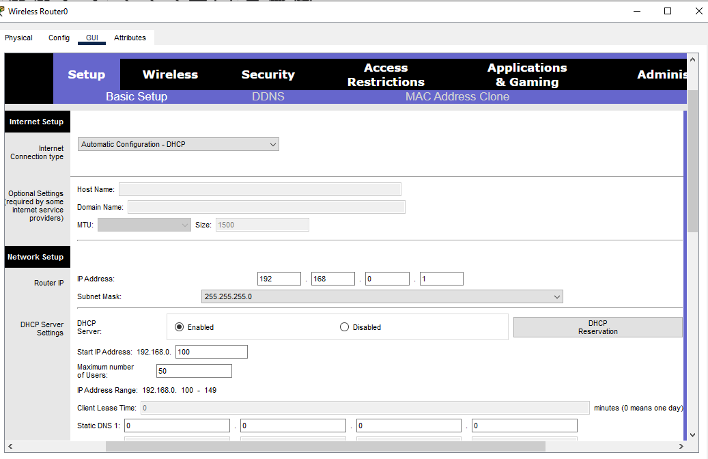

3. **Configuración del SSID:** Le asignamos a la red el nombre del grupo LAN-gustia (SSID).

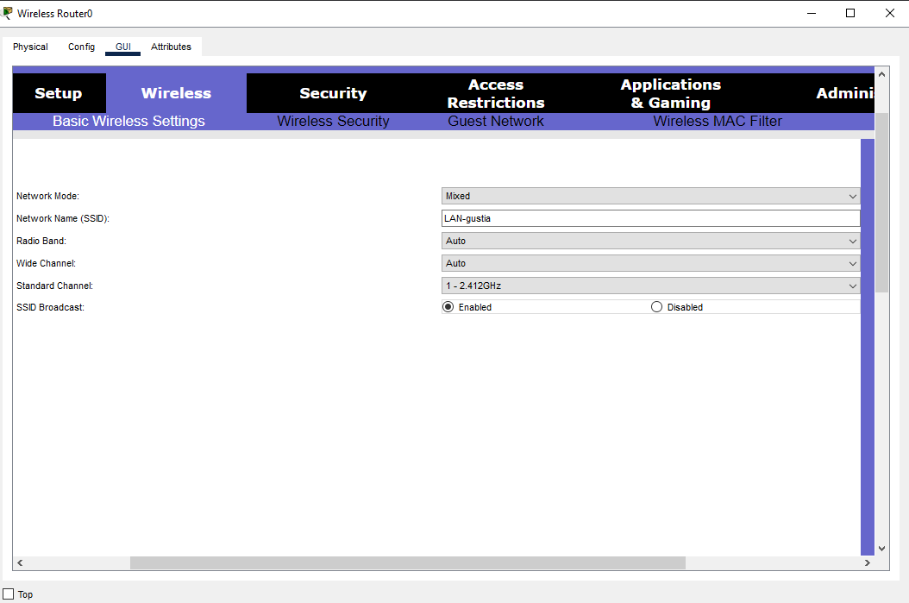

4. **Seguridad:** Configuramos la seguridad wireless para operar con **WPA2-PSK** con una contraseña de prueba (la que viene por default en algunos routers). 

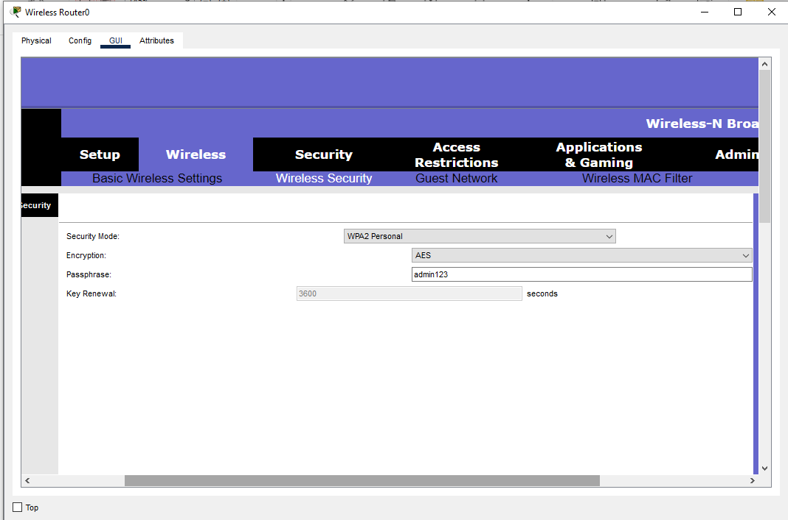

---
### 4.c Analisis de las configs del router

Podemos ver desde las configuraciones del mismo router que la frecuencia por defecto a la que opera es de **2.4 Ghz**, que se puede apreciar en la siguiente imagen: 

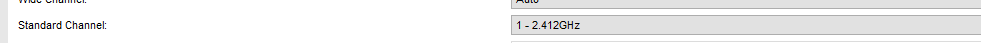

En cuando a la región del espectro electromagnético a la que pertenece esta frecuencia podemos decir que forma parte de las **microondas**, y opera dentro de la banda **UHF** (Ultra Alta Frecuencia), específicamente en la banda no licenciada **ISM** (Industrial, Científica y Médica), que abarca el rango de 2.4 GHz a 2.5 GHz (2400 MHz a 2500 MHz).

---
### 4.d Conexión y configuración de la pc de escritorio 

1. **Colocación de la Pc de escritorio**

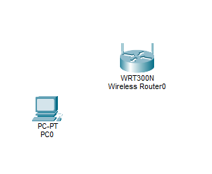

2. **Conexión fisica entre pc y router**

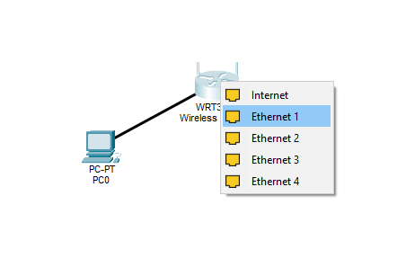
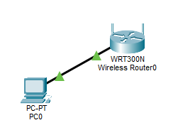
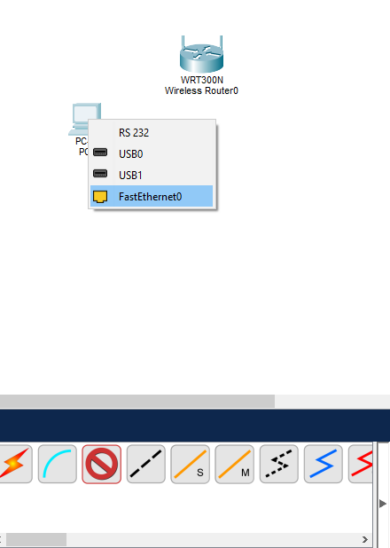

3. **Habilitación del DHCP** 

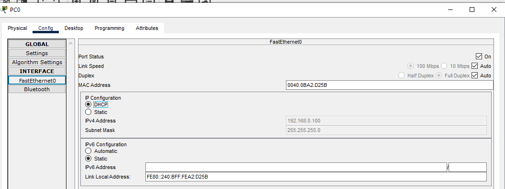

---