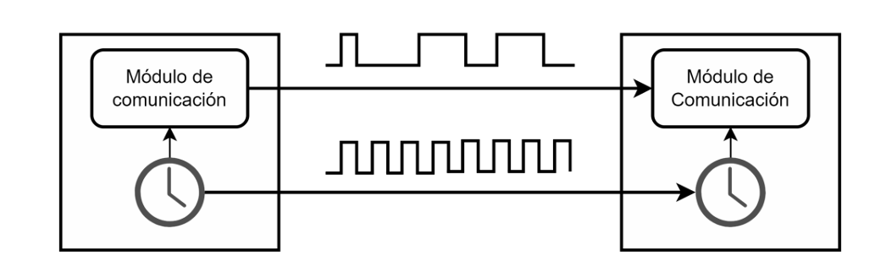
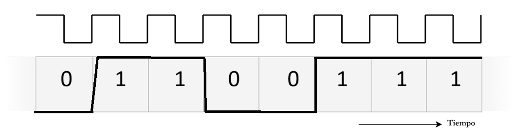
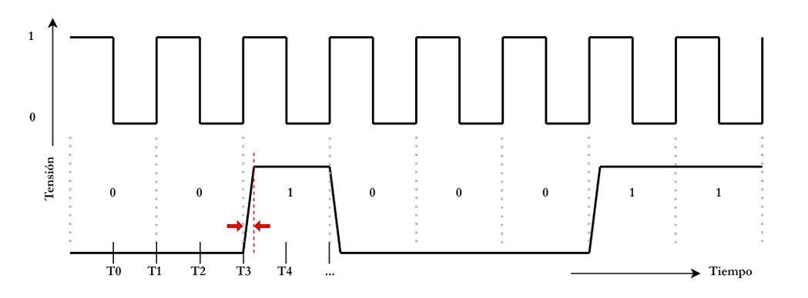
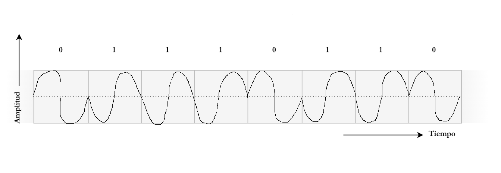

# Trabajo Practico N°1 - Redes de Computadoras
### **Grupo:** LAN-gustia 
---
### Integrantes: 
* Alvarado, Jazmin
* Aroca Bustos, Nahuel Ezequiel 
* Ibarra, Franco Ismael
* Lucero, Fabricio Agustin
* Soto, Milton Joaquin
* Zulaica, Federico

---
###  Desarrollo

## 1.

  a).Se puede observar 2 elementos, la onda seno que es periódica presenta una longitud de onda de 60 mm y la linea roja punteada nos muestra la atenuación de la señal (perdida de intensidad) a medida que la onda se propaga.

  
  b). La longitud de onda λ obtenido desde el grafico es 60 mm y considerando que la onda viaja a la velocidad de la luz c, la frecuencia se obtiene con la relacion f=c/λ, entonces f = 5x10^9 hz = 5Ghz.

  
  c). Una frecuencia de 5 GHz pertenece a la región de las ondas de radiofrecuencia (RF), específicamente dentro de la región de las microondas. Según la clasificación de la ITU, opera en la banda SHF (Super High Frequency / Súper Alta Frecuencia), cuyo rango comprende desde 3 GHz hasta 30 GHz.

  d) En la banda de 5 GHz operan diversos dispositivos de comunicación de datos que requieren altas tasas de transferencia, aunque con menor alcance frente a obstáculos. Por ejemplo un router Wi-Fi de doble banda (que utilice estándares como 802.11n, 802.11ac o 802.11ax). También operan en esta banda algunos teléfonos inalámbricos, enlaces de radio punto a punto, sistemas de radar meteorológico y dispositivos de transmisión de video inalámbrico.

e) La línea de trazos roja representa la atenuación de la señal. Este fenómeno consiste en la pérdida de intensidad (o amplitud) de la onda electromagnética a medida que se propaga a través de la distancia.

f) Sí, la atenuación afecta directamente a los routers Wi-Fi de 5 GHz. Esto es fácilmente observable cuando te alejas del router Wi-Fi. A medida que caminas hacia otra habitación, cruzas pasillos o subes a otro piso (donde la señal debe atravesar paredes y techos), el ícono de Wi-Fi en tu celular pierde "rayitas". La velocidad de navegación se reduce y, si la atenuación es excesiva, el dispositivo se desconecta por completo de la red.

g)
i) Sí. Las ondas de radio que conectan tu teléfono con las antenas celulares sufren atenuación por la distancia en el aire, así como por obstáculos físicos (edificios, árboles, montañas) e incluso por factores climáticos como la lluvia.

ii) Sí. A medida que la señal eléctrica viaja por el cobre del cable coaxial, pierde energía en forma de calor debido a la resistencia del conductor y a las fugas en el material dieléctrico aislante. Por esto, las redes de cable requieren amplificadores cada cierta distancia.

iii) Sí. Aunque la fibra óptica es el medio guiado que sufre la menor atenuación, la señal luminosa sigue perdiendo intensidad a lo largo de grandes distancias debido a impurezas en el vidrio (que absorben la luz) y a la dispersión. En enlaces submarinos o de cientos de kilómetros, se requieren repetidores ópticos para regenerar la señal.

## 2. 
a)  
Según la direccionalidad, el modo de transmisión es **Simplex**, o unidireccional, ya que las flechas van en un solo sentido, desde el módulo de comunicación del emisor hacia el módulo del receptor.

Y según las características temporales, el tipo de transmisión es **sincrónica**. Esto significa que los dos módulos de comunicación, emisor y receptor, están sincronizados por la misma señal de reloj.

b) No, no es el mejor paradigma para transmitir datos de forma rápida y bidireccional.

Como se menciona en el punto anterior, al ser una transmisión **Simplex**, la comunicación viaja en un solo sentido. Por lo tanto, para una transmisión bidireccional, la mejor opción es **Full-duplex**, la cual permite que ambos dispositivos puedan transmitir y recibir simultáneamente. Como segunda opción, se encuentra **Half-duplex**, pero en este caso la transmisión en ambos sentidos no puede realizarse de forma simultánea.

c) La 4ta letra del nombre de nuestro grupo es la **"g"**, por lo que le corresponde el número **103** en código ASCII y **01100111** en binario.

La representación en el gráfico sería la siguiente:

d) 

Para determinar el valor digital, mediría la señal en las marcas temporales que se encuentran en el centro de cada bit, es decir, en los **T pares** (T0, T2, T4, ...), que es cuando la señal ya es estable.

No se debería medir durante el cambio de nivel, ya que la pendiente de la señal puede producir un valor de tensión intermedio y modificar el valor real.

## 3. 

  a) La tecnica de modulacion que esta utiliazando en este caso es modulacion por desplazamiento de fase, ya que podemos ver que la fase se invierte cuando hay un cambio en el bit de datos.

  b) 

  c) Otras tecnicas de modulacion que se mencionan en el libro de Stallings  pueden ser modulación por desplazamiento de amplitud  y modulación por desplazamiento de frecuencia dentro de la cual se encuentran BFSK (Binary Frequency-Shift Keying) y MFSK (Multiple Frequency-Shift Keying)

  d)El Bit Error Rate es la probabilidad de que un bit transmitido llegue de forma errónea al receptor. Cuanto mayor es la relación señal-ruido menor es el BER. La tecnica que nos da mejores prestaciones es modulacion por desplazamiento de fase (PSK) ya que tiene mejor eficiencia del ancho de banda

## 4. Simulación en Cisco Packet Tracer 

### 4.a y 4.b - colocación y configuración del router

1. **Colocación del dispositivo:** Desde la categoría `network-devices > wireless-devices`, agregamos un router modelo **WRT300N** al área de trabajo.

2. **Configuración LAN:** configuramos la dirección IP para que sea `192.168.0.1` y `255.255.255.0` como máscara de subred.

3. **Configuración del SSID:** Le asignamos a la red el nombre del grupo LAN-gustia (SSID).

4. **Seguridad:** Configuramos la seguridad wireless para operar con **WPA2-PSK** con una contraseña de prueba (la que viene por default en algunos routers). 

---
### 4.c Analisis de las configs del router

Podemos ver desde las configuraciones del mismo router que la frecuencia por defecto a la que opera es de **2.4 Ghz**, que se puede apreciar en la siguiente imagen: 

En cuando a la región del espectro electromagnético a la que pertenece esta frecuencia podemos decir que forma parte de las **microondas**, y opera dentro de la banda **UHF** (Ultra Alta Frecuencia), específicamente en la banda no licenciada **ISM** (Industrial, Científica y Médica), que abarca el rango de 2.4 GHz a 2.5 GHz (2400 MHz a 2500 MHz).

---
### 4.d Conexión y configuración de la pc de escritorio 

1. **Colocación de la Pc de escritorio**

2. **Conexión fisica entre pc y router**

3. **Habilitación del DHCP** 

### 4.e. Instalacion de la NIC WI-Fi en la notebook

1. **Apagado de la notebook**

Primero es necesario apagar la notebook desde el boton fisico en la vista del dispositivo para poder modificar sus componenetes.

2. **Extraccion de la placa de red actual**

REtiramos la placa de red que viene por defecto en la ranura de expansion, arrastrandola hacia la columna de modulos a la izquierda.

3. **Colocacion del modulo Wi-Fi (WPC300N)**

Seleccionamos el modulo **WPC300N** desde la lista de modulos, lo arrastramos hacia la aranura que liberamos y luego volvemos a encender la notebook.

### 4.f. Conexion de la notebook a la red Wi-Fi

1. **Ingreso a la utilidad PC Wireless**

Dentro de las opciones de la notebook, vamos a la solapa **"Desktop"** (ubicada al lado de Config) y abrimos la aplicacion **"PC Wireless"**.

2. **Busqueda y conexion a la red**

Dentro de PC Wireless, nos dirigimos a la solapa connect. Esperamos a que aparezca la red inalambrica que configuramos, la seleccionamos y hacemos clic en conectar.

3. **Verificacion de la conexion ene l simulador**

UNa vez conectados exitosamente, al volver al area de trabjo principal, aparece un enlace (lineas punteadas) que representa la conexion inalambrica.

### 4.g. Verificacion de conectividad entre las computadoras

1. **Obtencion de IP en la PC de escritorio**

Desde el command Prompt de la PC de escritorio, ejecutamos el comando `ipconfig` para verificar la direccion IP asignada por DHCP, la cual es **192.168.0.102**.

2. **Obtencion de IP de la notebook**

Con el mismo procedimiento obtenemos la direccion IP asignada por DHCP a la notebook, la cual es **192.168.0.101**.

3. **Prueba de conectividad entre los equipos**

Desde la notebook enviamos un "ping" hacia la PC de escritorio, y desde la PC de escritorio realizamos un ping hacia la notebook. En ambos casos se recibieron correctamente los 4 paquetes sin ninguna perdida.

### 4.h. Analisis de la cobertura de la red Wi-Fi

1. **Ubicacion de la notebook en la posicion 1**

Movemos la notebook a una segunda habitacion u oficina, separada por paredes del router.

**Prueba ping:** Ejecutamos ping 192.168.0.102
**Resultado:** Se recibieron correctamente los 4 paquetes sin ninguna perdida, aunque se nota una leve disminucion en la calidad de la señal.

2. **Ubicacion de la notebook en la posicion 2**

Ubicamos la notebook en el punto mas alejado, atravesando varias paredes.
**Prueba ping:** Ejecutamos ping 192.168.0.102
**Resultado:** Se presentan perdidas de paquetes (mensajes de *Request timed out*), demostrando lad egradacion del enlace por atenuacion y distancia.

---
