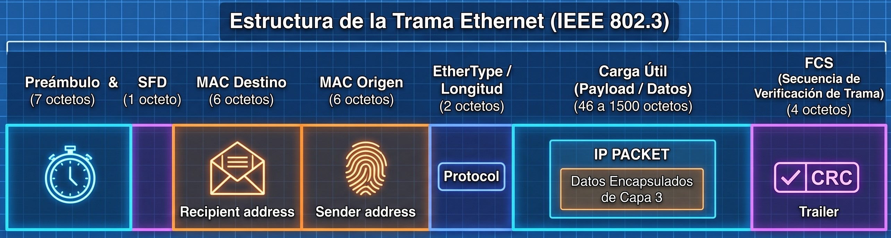

# Trabajo práctico N° 3 - Redes de Computadoras

**Grupo:** LAN-gustia

---

## Integrantes
* Alvarado, Jazmin
* Aroca Bustos, Nahuel Ezequiel
* Ibarra, Franco Ismael
* Lucero, Fabricio Agustin
* Soto, Milton Joaquin
* Zulaica, Federico

---

## Desarrollo

# 1. 

## 1.a 
La Capa de Enlace de Datos (**Capa 2 del modelo OSI**) se encarga de garantizar una transferencia confiable y sin errores de la información entre dos dispositivos conectados directamente en una misma red, Esto lo realiza tomando los paquetes de datos provenientes de la Capa de Red, encapsularlos en estructuras manejables llamadas tramas (frames), y entregarlos a la Capa Física para su codificación en señales eléctricas, ópticas o de radio.
Sus funciones principales pueden resumirse en: 
* **Detección de errores:** Se asegura de que los impulsos físicos que viajaron por el cable no hayan sido corrompidos por ruido o interferencias durante el trayecto.

* **Control de acceso al medio (MAC):** Orquesta cómo y cuándo los dispositivos pueden transmitir en un medio compartido, evitando o gestionando colisiones.

**Tipo de comunicación que resuelve**

Resuelve estrictamente la comunicación nodo a nodo dentro de una misma red local (LAN). La Capa de Enlace no tiene conocimiento de la topología global de Internet; su jurisdicción termina en el puerto del router más cercano (el Default Gateway). Solo le interesa cómo llevar un bloque de bytes de la tarjeta de red A a la tarjeta de red B conectadas en el mismo segmento físico o lógico.

## 1.b 
Una Dirección **MAC (Media Access Control)** es una dirección física y plana (sin jerarquía) de 48 bits, representada en formato hexadecimal. Viene grabada de fábrica en el hardware de la Tarjeta de Interfaz de Red (NIC) y es universalmente única e inmutable. Opera en la Capa 2 y sirve para entregar datos físicamente dentro de una misma LAN.

**¿Cómo está formada?**

Consta de 12 dígitos hexadecimales (números del 0 al 9 y letras de la A a la F), agrupados en seis parejas.
* Los primeros 6 dígitos identifican al fabricante del hardware.
* Los últimos 6 dígitos corresponden al número de serie específico de ese dispositivo.

Se diferencia de una **dirección IP**, ya que esta última es una dirección lógica y jerárquica (de 32 bits en IPv4 o 128 bits en IPv6). Es asignada por software y puede cambiar dependiendo de a qué red se conecte el dispositivo. Opera en la Capa 3 y su propósito es el enrutamiento: permite que los paquetes viajen a través de múltiples redes distintas hasta llegar a su destino final.

## 1.c 
Una trama Ethernet **(Frame)** es la Unidad de Datos de Protocolo **(PDU)** de la capa de enlace. Es el bloque estructurado de información que encapsula los datos antes de ser convertidos en señales (bits) para el medio físico.

Sus campos principales, en orden, son:

* **Preámbulo y SFD (Delimitador de Inicio de Trama)**: Sincronizan los relojes del emisor y del receptor, indicando que una nueva trama está a punto de comenzar.

* **Dirección MAC de Destino**: Identifica al dispositivo de la red local que debe recibir y procesar la trama.

* **Dirección MAC de Origen**: Identifica al dispositivo que generó y envió la trama al medio.

* **Tipo / Longitud (EtherType)**: Indica qué tipo de protocolo de capa superior está encapsulado en el área de datos, o bien, el tamaño exacto de la trama.

* **Carga Útil (Payload o Datos)**: Es la información real que se está transportando (usualmente un paquete IP proveniente de la Capa 3). Su tamaño varía entre 46 y 1500 bytes.

* **FCS (Secuencia de Verificación de Trama)**: Es el trailer o cola de la trama. Contiene un código de redundancia cíclica **(CRC)** que permite al receptor verificar matemáticamente si los bits llegaron intactos o si sufrieron corrupción por ruido o atenuación física.

## 1.d 
La información que permite a la tarjeta de red saber a qué protocolo superior debe entregar los datos es el campo Tipo **(EtherType)** mencionado anteriormente.

Este campo de 2 bytes contiene un código hexadecimal estandarizado. Al leerlo, el receptor sabe cómo debe procesar la carga útil. Por ejemplo, si el campo EtherType tiene el valor 0x0800, el hardware sabe que está transportando un paquete IPv4 y lo envía al software correspondiente; si el valor es 0x0806, sabrá que es un paquete ARP (Protocolo de Resolución de Direcciones).