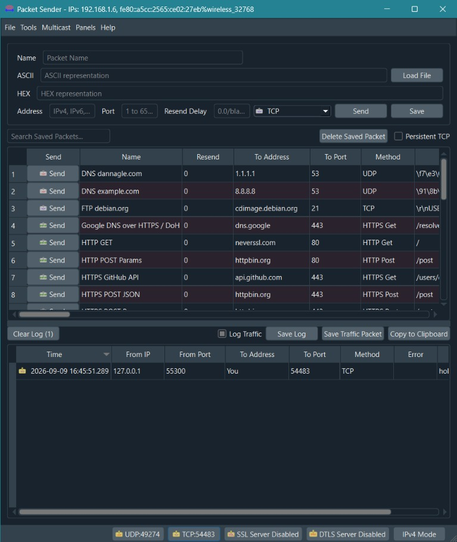
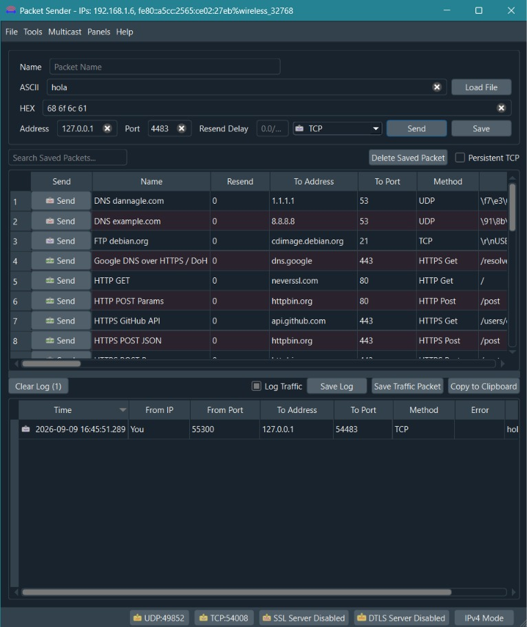
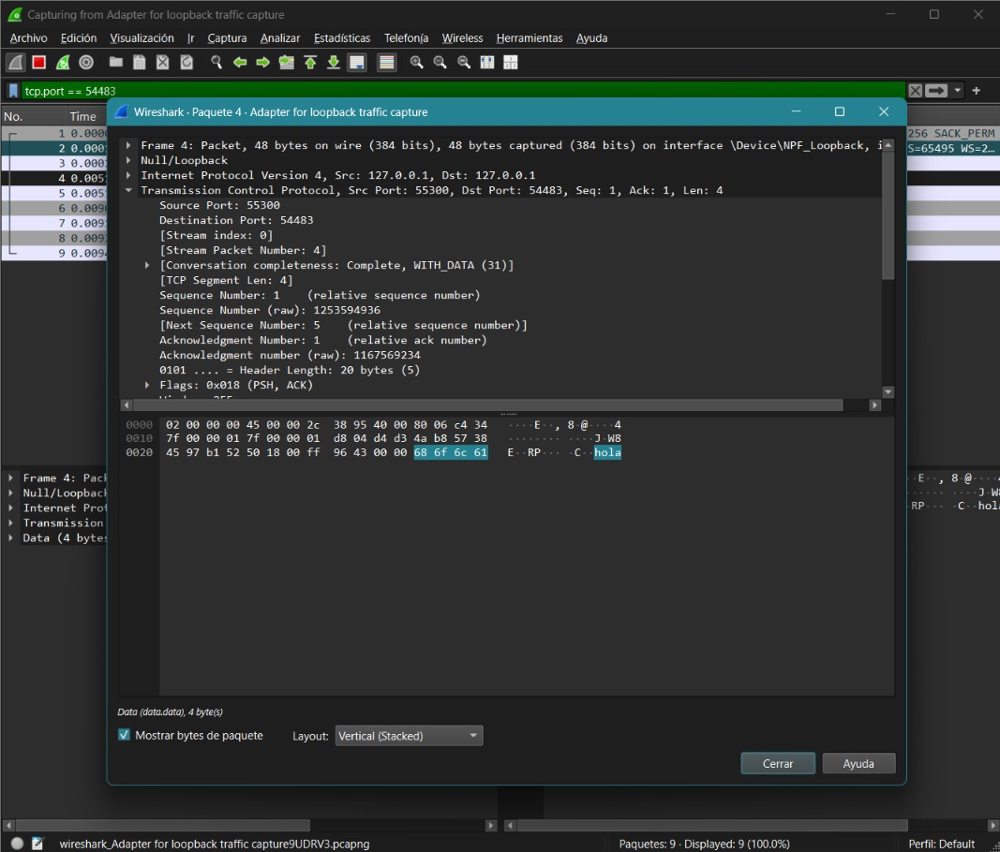
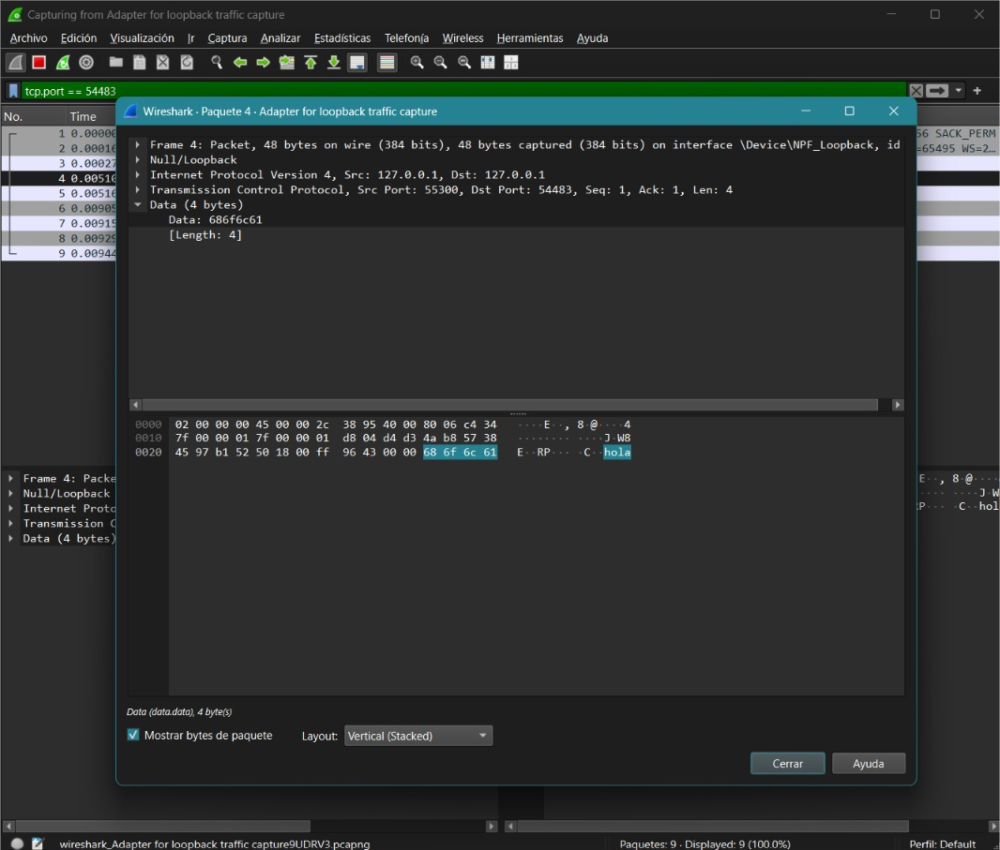
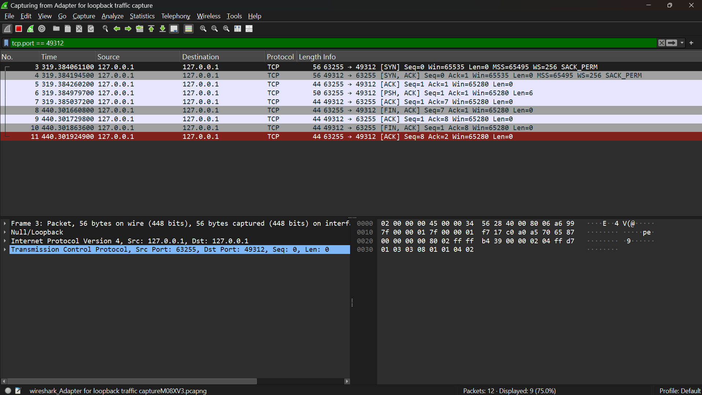
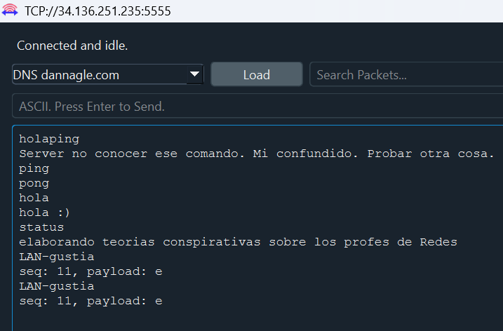
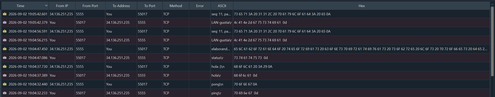
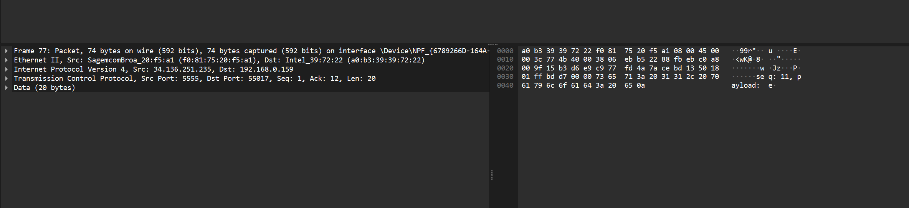

# Trabajo práctico N° 3 - Redes de Computadoras

**Grupo:** LAN-gustia

---

## Integrantes
* Alvarado, Jazmin
* Aroca Bustos, Nahuel Ezequiel
* Ibarra, Franco Ismael
* Lucero, Fabricio Agustin
* Soto, Milton Joaquin
* Zulaica, Federico

---

## Desarrollo

# 1. 

## 1.a 
La Capa de Enlace de Datos (**Capa 2 del modelo OSI**) se encarga de garantizar una transferencia confiable y sin errores de la información entre dos dispositivos conectados directamente en una misma red, Esto lo realiza tomando los paquetes de datos provenientes de la Capa de Red, encapsularlos en estructuras manejables llamadas tramas (frames), y entregarlos a la Capa Física para su codificación en señales eléctricas, ópticas o de radio.
Sus funciones principales pueden resumirse en: 
* **Detección de errores:** Se asegura de que los impulsos físicos que viajaron por el cable no hayan sido corrompidos por ruido o interferencias durante el trayecto.

* **Control de acceso al medio (MAC):** Orquesta cómo y cuándo los dispositivos pueden transmitir en un medio compartido, evitando o gestionando colisiones.

**Tipo de comunicación que resuelve**

Resuelve estrictamente la comunicación nodo a nodo dentro de una misma red local (LAN). La Capa de Enlace no tiene conocimiento de la topología global de Internet; su jurisdicción termina en el puerto del router más cercano (el Default Gateway). Solo le interesa cómo llevar un bloque de bytes de la tarjeta de red A a la tarjeta de red B conectadas en el mismo segmento físico o lógico.

## 1.b 
Una Dirección **MAC (Media Access Control)** es una dirección física y plana (sin jerarquía) de 48 bits, representada en formato hexadecimal. Viene grabada de fábrica en el hardware de la Tarjeta de Interfaz de Red (NIC) y es universalmente única e inmutable. Opera en la Capa 2 y sirve para entregar datos físicamente dentro de una misma LAN.

**¿Cómo está formada?**

Consta de 12 dígitos hexadecimales (números del 0 al 9 y letras de la A a la F), agrupados en seis parejas.
* Los primeros 6 dígitos identifican al fabricante del hardware.
* Los últimos 6 dígitos corresponden al número de serie específico de ese dispositivo.

Se diferencia de una **dirección IP**, ya que esta última es una dirección lógica y jerárquica (de 32 bits en IPv4 o 128 bits en IPv6). Es asignada por software y puede cambiar dependiendo de a qué red se conecte el dispositivo. Opera en la Capa 3 y su propósito es el enrutamiento: permite que los paquetes viajen a través de múltiples redes distintas hasta llegar a su destino final.

## 1.c 
Una trama Ethernet **(Frame)** es la Unidad de Datos de Protocolo **(PDU)** de la capa de enlace. Es el bloque estructurado de información que encapsula los datos antes de ser convertidos en señales (bits) para el medio físico.

Sus campos principales, en orden, son:

* **Preámbulo y SFD (Delimitador de Inicio de Trama)**: Sincronizan los relojes del emisor y del receptor, indicando que una nueva trama está a punto de comenzar.

* **Dirección MAC de Destino**: Identifica al dispositivo de la red local que debe recibir y procesar la trama.

* **Dirección MAC de Origen**: Identifica al dispositivo que generó y envió la trama al medio.

* **Tipo / Longitud (EtherType)**: Indica qué tipo de protocolo de capa superior está encapsulado en el área de datos, o bien, el tamaño exacto de la trama.

* **Carga Útil (Payload o Datos)**: Es la información real que se está transportando (usualmente un paquete IP proveniente de la Capa 3). Su tamaño varía entre 46 y 1500 bytes.

* **FCS (Secuencia de Verificación de Trama)**: Es el trailer o cola de la trama. Contiene un código de redundancia cíclica **(CRC)** que permite al receptor verificar matemáticamente si los bits llegaron intactos o si sufrieron corrupción por ruido o atenuación física.

## 1.d 
La información que permite a la tarjeta de red saber a qué protocolo superior debe entregar los datos es el campo Tipo **(EtherType)** mencionado anteriormente.

Este campo de 2 bytes contiene un código hexadecimal estandarizado. Al leerlo, el receptor sabe cómo debe procesar la carga útil. Por ejemplo, si el campo EtherType tiene el valor 0x0800, el hardware sabe que está transportando un paquete IPv4 y lo envía al software correspondiente; si el valor es 0x0806, sabrá que es un paquete ARP (Protocolo de Resolución de Direcciones).
# 2.

## 2.a
La dirección MAC de origen es 84:5c:f3:5a:1d:79 que es correspondiente a la interfaz de red de la computadora desde la cual se hizo la captura. La dirección MAC de destino es 44:d4:54:b7:d3:a4, correspondiente al router o punto de acceso de la red local.

## 2.b
La dirección IP de origen es 192.168.0.215 y la dirección IP de destino es 103.88.232.71

## 2.c
No representan lo mismo. La dirección IP permite identificar el destino y realizar el encaminamiento de los datos entre diferentes redes, mientras que la dirección MAC se utiliza para identificar la interfaz dentro de la red local. En la captura se observa que la dirección MAC de destino corresponde al dispositivo de la red local, mientras que la dirección IP de destino corresponde al destino final de la comunicación.

## 2.d
El campo EtherType tiene el valor 0x0800, que indica que el protocolo encapsulado dentro de la trama Ethernet es IPv4.

# 3.

## 3.a
TCP (Transmition Control Protocol) se encarga de proporcionar una comunicacion confiable y orientada a conexion entre dos dispositivos.
Ni ethernet ni IP garantizan por si mismo que los datos lleguen correctamente y en el orden en que fueron enviados.
Los problemas que resuelve TCP son:
* **Perdida de paquetes**: TCP puede detectar que determinados datos no fueron recibidos y solicitar su retransmision.
* **Entrega ordenada**: Los segmentos pueden llegar en un orden diferente al que fueron enviados. TCP utiliza numeros de secuencia para reconstruir los datos en el orden correcto.
* **Deteccion de errores**: TCP utiliza checksum (suma de verificacion) para detectar si un segmento fue alterado durante la transmision.
* **Control de flujo**: TCP evita que un emisor envie datos a una velocidad superior a la que el receptor puede procesar.
* **Control de congestion**: TCP adapta la velocidad de transmision cuando detecta que existe congestion en la red.
* **Establecimiento y finalizacion de la conexion**: TCP establece una conexion mediante Three-Way Handshake antes de enviar datos y la finaliza cuando termina la comunicacion.

## 3.b
Los principales campos de la cabecera TCP son:
* **Source port**: Identifica al puerto de origen del segmento.
* **Destination port**: Identifica al puerto de destino del segmento.
* **Sequence number**: Permite ordenar los datos y detectar segmentos faltantes o duplicados.
* **Acknowledgement number**: Indica que datos fueron recibidos y cual es el siguiente numero de secuencia esperado.
* **Header length**: Indica el tamaño de la cabecera TCP.
* **Flags**: Indica diferentes estados y funciones del segmento, como SYN, ACK, FIN, RST, PSH y URG.
* **Window size**: Identifica al tamaño de la ventana del segmento.
* **Checksum**: Identifica a la suma de verificación del segmento.
* **Urgent pointer**: Indica la ubicacion de datos urgentes cuando se utiliza el flag URG.
* **Options**: Permite incorporar funcionalidades adicionales, como MSS, Window Scale y SACK.

## 3.c
Three-Way Handshake (Establecimiento de la conexión)
* **SNY (Sincronización)**: El cliente manda un paquete con el flag SYN en 1, preguntando si esta disponible para conectar.
* **SNY + ACK**: El servidor responde con ambos flags en 1, el SYN dice que sí esta disponible para conectarse y el ACK confirma la recepción del pedido de conexión.
* **ACK (Reconocimiento)**: El cliente confirma, se establece la conexión y pueden empezar a comunicarse.
  
Four-way Handshake (Terminando la conexión)
* **Cliente (FIN):** Le comunica al servidor que no hay nada más que enviar.
* **Servidor (ACK):** Confirma que recibió el aviso del cliente.
* **Servidor (FIN):** Le comunica al cliente que no tiene nada más para enviarle.
* **Cliente (ACK):** Confirma la recepción del FIN.

Iniciamos una instancia de PacketSender como servidor TCP, tomando nota del puerto asignado (54483), y otra instancia como cliente apuntando a localhost (127.0.0.1) y ese puerto. Configuramos Wireshark para capturar la interfaz de loopback con el filtro tcp.port == 54483.

| Servidor PacketSender | Cliente PacketSender |
| :---: | :---: |
|  |  |

## 3.d
Se selecciono el paquete N°4 en Wireshark, correspondiente a la transmisión del mensaje desde el cliente hacia el servidor. Presenta los flags [PSH, ACK], indicando que la capa de transporte entrega la información de inmediato a la aplicación receptora.

* **Análisis de estructura**:

  * **Capa de enlace (Null/Loopback)**: Registra el paso de datos a través de la interfaz virtual local (127.0.0.1)
  *  **Capa de red (Internet Protocol Version 4)**:
      * **IP Origen (src)**: 127.0.0.1
      * **IP Destino (dst)**: 127.0.0.1
  * **Capa de transporte (Transmission Control Protocol)**:
      * **Puerto Origen:** 55300 (puerto asignado al cliente)
      * **Puerto Destino:** 54483 (puerto del servidor)
      * **Longitud del segmento (Len):** 4 bytes
* **Identificación de la Carga Útil (Payload)**:

    Al revisar el volcado de bytes en la parte inferior de Wireshark, se identificaron los datos transmitidos:
* **Código Hexadecimal:** 68 6f 6c 61
* **Representación ASCII:** **hola**

| Cabecera TCP y Puertos | Carga Útil Resaltada |
| :---: | :---: |
|  |  |

## 3.e

Se finalizó la conexión persistente desde Packet Sender y se capturó la secuencia completa de cierre en Wireshark (visibles en los paquetes 8 a 11).

- **Four-way Handshake (Terminando la conexión):**
  - **[FIN, ACK] (Paquete 8):** Un extremo de la comunicación notifica que no enviará más datos y solicita cerrar la conexión.
  - **[ACK] (Paquete 9):** El otro extremo avisa de la solicitud de cierre.
  - **[FIN, ACK] (Paquete 10):** El segundo extremo envía su propio aviso de cierre indicando que él tampoco tiene más datos que transmitir.
  - **[ACK] (Paquete 11):** El primer extremo confirma el último aviso, finalizando formalmente la conexión en ambas direcciones.

| **Captura del Four-way Handshake en Wireshark** |
| ----------------------------------------------- |
|              |

## 3.f

La conclusión principal que podemos sacar es que **los protocolos de red que transmiten información en texto plano son inseguros**, especialmente cuando se utilizan en redes compartidas o públicas. Durante la práctica pudimos comprobar que, mediante herramientas como Wireshark, es posible capturar los paquetes y visualizar el contenido de los datos que se están transmitiendo. Esto demuestra que, si no se utilizan mecanismos de seguridad, información sensible como contraseñas, credenciales o mensajes privados, puede quedar expuesta. Por este motivo, es importante utilizar protocolos que incorporen cifrado, como HTTPS/TLS, para que, aunque un paquete sea interceptado, su contenido no pueda ser leído fácilmente por terceros.

## 4
La consigna nos indica conectarnos a un servidor indicado por el profe y se nos indica documentar la respuesta del server. La respuesta del server varia dependiendo del ascci que le mandes como se puede ver en las capturas de pantalla, en el caso del nombre de nuestro grupo respondio lo siguiente:
seq: 11, payload: e

