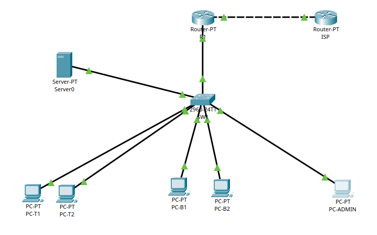
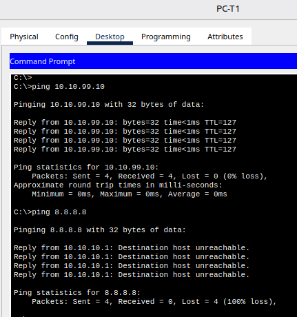
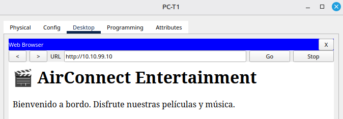
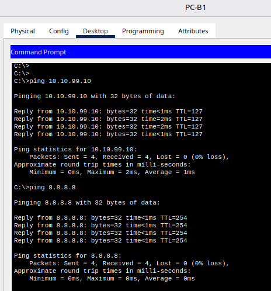
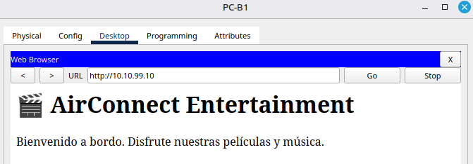
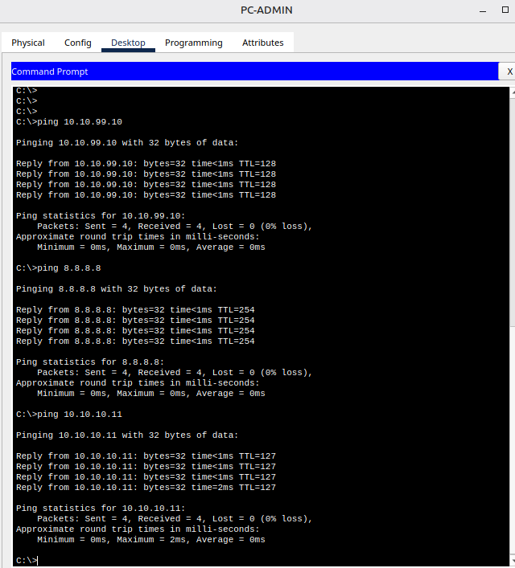

# Trabajo práctico N° 4 - Redes de Computadoras

**Grupo:** LAN-gustia

---

## Integrantes
* Alvarado, Jazmin
* Aroca Bustos, Nahuel Ezequiel
* Ibarra, Franco Ismael
* Lucero, Fabricio Agustin
* Soto, Milton Joaquin
* Zulaica, Federico Jose

---

## Desarrollo

# 1. 

# 2.
 La red consiste en dos computadoras (PC-A y PC-B) conectadas a través de dos switches (SW-1 y SW-2).

 * **Conexiones de Datos:** Se utilizan cables directos (FastEthernet) entre las PCs y los switches, y un cable cruzado entre los dos switches.

 * **Conexiones de Administración:** Se configuran cables de consola (RS-232 a Console) desde cada PC a su respectivo switch para su gestión inicial.

  

## Tabla de Direccionamiento

 | **Device** | **Interface** | **IP Address** | **Subnet Mask** | **Default Gateway** |
 | ---------- | ------------- | -------------- | --------------- | ------------------- |
 | **SW-1**   | VLAN 1        | 192.168.1.11   | 255.255.255.0   | N/A                 |
 | **SW-2**   | VLAN 1        | 192.168.1.12   | 255.255.255.0   | N/A                 |
 | **PC-A**   | NIC           | 192.168.10.3   | 255.255.255.0   | 192.168.10.1        |
 | **PC-B**   | NIC           | 192.168.10.4   | 255.255.255.0   | 192.168.10.1        |

 Se configuraron las direcciones IP estáticas desde la interfaz gráfica de las computadoras (Desktop > IP Configuration).

 | IP PC-A | IP PC-B |
 | :---: | :---: |
 |  | |

## 2.a
 Desde la terminal de las PCs (vía cable de consola), se ingresó al modo de configuración global para designar los nombres correspondientes (SW-1 y SW-2).
 | Designación del nombre de sw2 (mismo precedimiento para sw1)| 
 | :---: |
 | |

## 2.b y 2.c

 Para proteger el acceso a los dispositivos, se configuraron contraseñas para el modo privilegiado (*class*), el acceso por consola (*cisco*) y el acceso remoto VTY (*cisco*).

 - *(config)# enable secret class*

 - *(config-line)# password cisco*

 - *(config)# line vty 0 15*

 - *(config-line)# password cisco*

 Para evitar que las contraseñas de consola y VTY se lean en texto plano en la configuración del equipo, se habilitó el servicio de encriptación.

 - *(config)# service password-encryption*
 
 | Asignación y encriptación sw1 | Asignación y encriptación sw2 |
 | :---: | :---: |
 | |  |

## 2.d
 Se asignaron las direcciones IP de administración a la VLAN 1 de ambos switches, colocando las interfaces correspondientes.
 | Red VLAN sw1 | Red VLAN sw2 |
 | :---: | :---: |
 |  |  |

 

## 2.e
Se utilizó el comando show ip interface brief para identificar las interfaces utilizadas y las que se encontraban libres. En ambos switches, Fa0/1 y Fa0/2 son las interfaces utilizadas en la topología. Las demás interfaces fueron deshabilitadas mediante el comando shutdown

| sw1 |  sw2 |
 | :---: | :---: |
 | |  |

## 2.f
Una vez finalizada la configuración de los switches, se guardó la configuración realizada para evitar que los cambios se pierdan al reiniciar los dispositivos.

En SW1 y SW2 se utilizó write memory

||

## 2.g
Se verificó la comunicación entre los dispositivos mediante el comando ping.

 | ping desde PC-A hacia PC-B | ping desde PC-B hacia PC-A|
 | :---: | :---: |
 |  | |

## 2.h
Se creo las siguientes VLANs en ambos switches. 
VLAN 10: Laboratorio
VLAN 20: Bar
VLAN 99: Management
verificando la configuración mediante show vlan brief

| sw1 |  sw2 |
 | :---: | :---: |
 | |  |

## 2.i

## 2.j

## 2.k

## 2.l

## 2.m

## 2.n

# 3. Simulacion de Red LAN a bordo

**1. Topologia de Red**

**2. Configuracion Logica**
Se segmento la red en tres areas con distintos privilegios:
* **VLAN10 (Turista - 10.10.10.0/24):** Se aplico un ACL (LIsta de Control de Acceso) para denegar el trafico externo, limitando la conexion solo al servidor local.
* **VLAN20 (Business - 10.10.20.0/24):** Se configuro NAT dinamico para permitir la salida a Internet y acceso al servidor.
* **VLAN99 (Admin - 10.10.99.0/24):** Cuenta con enrutamiento y acceso total a cualquier destino.

**3. Pruebas**

*   **Turista:** Ping exitoso y HTTP web a `10.10.99.10`. Ping a `8.8.8.8` denegado (Destination host unreachable).

*   **Business:** HTTP web a `10.10.99.10` funcional y ping exitoso a `8.8.8.8`.

*   **Admin:** Pings exitosos a todos los dispositivos (servidor, Internet y PCs).

**4. Conclusión**
El uso de **VLANs** permitió aislar el tráfico de los pasajeros en una misma infraestructura. Al combinar esto con NAT para la salida a Internet y ACLs para filtrar paquetes, se logró aplicar con éxito la política comercial de la aerolínea: dar internet a Business y restringir a Turista exclusivamente al entretenimiento a bordo.
