# Trabajo práctico N°  5 - Redes de Computadoras

**Grupo:** LAN-gustia

---

## Integrantes
* Alvarado, Jazmin
* Aroca Bustos, Nahuel Ezequiel
* Ibarra, Franco Ismael
* Lucero, Fabricio Agustin
* Soto, Milton Joaquin
* Zulaica, Federico Jose

---

## Desarrollo

# 1. ICMP y primer contacto con Wireshark.

### a) 
ICMP (Internet Control Message Protocol) es un protocolo utilizado para transmitir mensajes de control e información sobre problemas de comunicación en la red IP. Este protocolo no se utiliza para transportar datos de aplicaciones como TCP o UDP, sino para intercambiar información de control relacionada con el funcionamiento de IP.

### b)
ICMP es un protocolo de la capa de red que trabaja de forma complementaria con IP. Aunque se considera del mismo nivel dentro de la arquitectura TCP/IP, actúa como usuario de IP y sus mensajes viajan dentro de IP, encapsulándose directamente en la carga útil del datagrama IP. El receptor reconoce que el contenido corresponde a ICMP mediante el campo Protocol de la cabecera IP, el cual lleva asignado el valor 1.

### c)
* **Ping:** Es una herramienta de diagnostico de red, permite comprobar si existe comunicación entre dos entidades de una red.
* **Echo Request:** es el mensaje ICMP de eco que se envía al destino para verificar si responde.
* **Echo Reply:** es la respuesta que debe devolver el receptor al recibir un mensaje de eco.
* **Campos que permiten distinguirlos:** el campo Type de la cabecera ICMP identifica que clase de mensaje es. Tanto Echo Request como Echo Reply conservan el mismo identificador y numero de secuencia, lo que permite relacionar cada respuesta con su petición correspondiente.

### d)
Un mensaje ICMP de tipo Echo contiene campos Type, Code, suma de comprobación, identificador y numero de secuencia. El identificador permite reconocer una sesión particular y el numero de secuencia permite asociar cada petición con su respuesta correspondiente. Además, el mensaje puede incluir un campo de datos.

### Averiguar la configuración de red de alguna de las computadoras del grupo: dirección IPv4, máscara, gateway por defecto y dirección MAC de la interfaz que usan (Wi-Fi o cableada).

### Configuración de red (equipo con Windows, adaptador Wi-Fi)

Obtenida con ipconfig /all:

| Dato | Valor |
|---|---|
| Adaptador | Intel(R) Wireless-AC 9560 (Wi-Fi) |
| Dirección IPv4 | 192.168.1.20 |
| Máscara de subred | 255.255.255.0 (/24) |
| Gateway por defecto | 192.168.1.1 |
| Dirección MAC | 84-5C-F3-5A-1D-79 |
| Servidor DHCP | 192.168.1.1 |

Se realizo ping a la IP del gateway por defecto y luego a
una IP de Internet:

Aplicamos el filtro icmp:

### Tabla de capas (Echo Request a 8.8.8.8, frame 14509)

| Capa (Wireshark) | Origen | Destino | Campo que indica el protocolo de adentro |
|---|---|---|---|
| Ethernet II | 84:5c:f3:5a:1d:79 (Intel_5a:1d:79, mi placa Wi-Fi) | b8:9f:cc:c1:4c:50 (HuaweiTechno_c1:4c:50, mi router/gateway) | **Type: IPv4 (0x0800)** |
| Internet Protocol Version 4 | 192.168.1.20 | 8.8.8.8 | **Protocol: ICMP (1)** |
| Internet Control Message Protocol | No tiene direcciones propias: viaja entre las IP del encabezado IPv4. Se identifica con Type 8 (Echo request), Code 0, Identifier 1 y Sequence 945 | No tiene | No tiene campo de protocolo: después del encabezado ICMP (8 bytes) vienen directamente los datos |
| Datos / payload (Data) | No tiene | No tiene | No hay protocolo adentro |

### a) MAC destino

La MAC destino del Echo Request a 8.8.8.8 es `b8:9f:cc:c1:4c:50`, que **no** es la de 8.8.8.8 sino la del router (HuaweiTechno, gateway 192.168.1.1). Es idéntica a la MAC destino del ping al gateway (frame 14379). 8.8.8.8 está fuera de mi LAN, así que la PC entrega la trama al router y este la reenvía. Por lo que se conluye que la dirección MAC solo tiene alcance local (un salto) y cambia en cada salto; la dirección IP identifica a los extremos y se mantiene de punta a punta.

### b) Echo Request (frame 14509) vs. Echo Reply (frame 14510)

| Capa | Campos que cambian | Campos que se mantienen |
|---|---|---|
| Ethernet | MAC origen y destino (se invierten); Type (0x0800 → 0x8100, por el tag 802.1Q del Reply) | Las dos MAC (solo cambian de rol) |
| IPv4 | IP origen y destino (se invierten); TTL (128 → 118); Identification (0xa889 → 0x0000); Header Checksum (0x0000 → 0x72f5) | Versión, Header Length, DSCP, Total Length (60), Flags, Fragment Offset, Protocol (ICMP) |
| ICMP | Type (8 → 0); Checksum (0x49aa → 0x51aa) | Code (0), Identifier (1), Sequence Number (945), Data (32 bytes) |

- **MAC e IP origen/destino:** se invierten porque el Reply viaja en sentido contrario ; **Ethernet Type:** el router agregó un tag 802.1Q (VLAN ID 0, solo prioridad) al Reply; por eso el Type es 0x8100 y el frame mide 78 bytes en vez de 74 ; **TTL:** cada emisor define el suyo (mi PC arranca con 128) y cada router intermedio le resta 1 ; **Identification:** es un contador propio de cada emisor, no tiene por qué coincidir ; **Header Checksum IP:** en el Request vale 0x0000 porque la placa lo calcula al enviar, en el Reply aparece el valor calculado por quien lo envió ; **ICMP Type:** distingue Request (8) de Reply (0) ;  **ICMP Checksum:** cambia porque cambió el Type (0x49aa + 0x0800 = 0x51aa).

El Identifier y el Sequence Number se mantienen porque ping los usa para asociar cada respuesta con su pedido: el Identifier identifica al proceso ping y el Sequence Number a cada pedido dentro de esa ejecución. Por eso el Reply los devuelve sin modificar.

### c) Payload

El payload está dentro del mensaje ICMP, después de Identifier y Sequence Number. Tiene 32 bytes y contiene los caracteres `abcdefghijklmnopqrstuvwabcdefghi`. En el Reply es exactamente igual, devuelve los mismos datos que recibió.

No se probó en otra computadora con Linux pero por lo general se sabe que suele enviar 56 bytes de datos lo que sugiere que el contenido del payload lo define cada implementación del SO, ya que el estándar solo exige que el Reply lo devuelva igual.

### d) TTL

- Echo Request enviado: TTL = **128** .
- Echo Reply recibido de 8.8.8.8: TTL = **118**.

No son iguales porque cada emisor arranca con su propio TTL inicial y cada router que atraviesa el paquete le resta 1; si llega a 0, el router lo descarta lo que evita que los paquetes circulen indefinidamente por bucles de ruteo.

### e) Encapsulación (Echo Request, frame 14509)

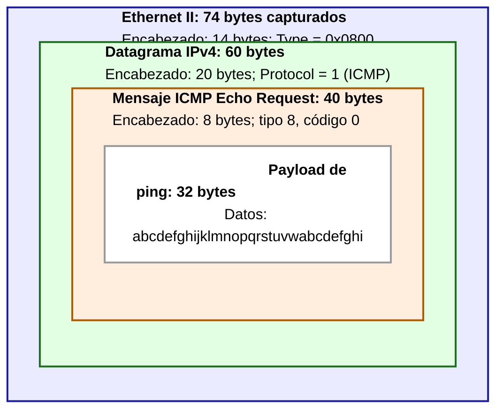

 # 3 TCP y UDP "a mano" con ncat

## 3A
Establecer una conexión significa que dos procesos se pongan de acuerdo antes de intercambiar datos, sincronizando sus números de secuencia iniciales y otros parámetros. Esto se realiza mediante los paquetes de sincronizacion y confirmación. Una conexion existe unicamente en los extremos, al establecerse cada entidad de transporte reserva recursos y lleva la cuenta de los segmentos enviados y recibidos. Los cables y los routers no guardan informacion de la conexion 

## 3B
Un puerto es un numero que identifica a un proceso o aplicacion dentro de un host, este es unico dentro del host otro host puede usar el mismo puerto para otro proceso por eso el par IP/puerto es el que identifica el extremo de la comunicacion

## 3C
Que un proceso esté escuchando en un puerto significa que le pidió al sistema operativo que le entregue las solicitudes de conexión o los datos que lleguen a ese puerto.

## 3A
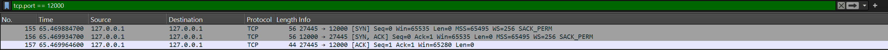

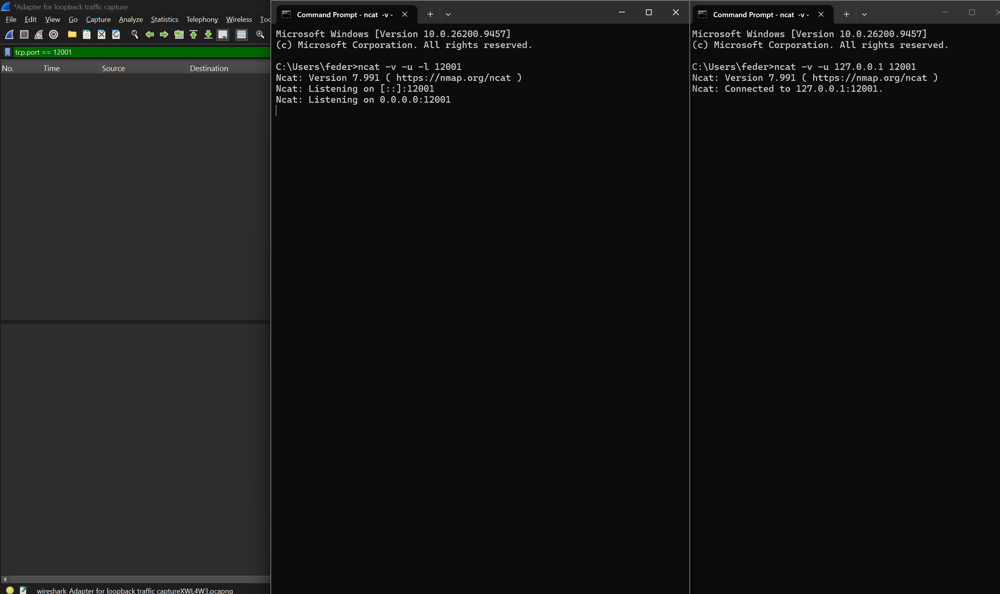

Se puede observar que no realiza un handshake previo y en UDP el cliente solo registra la direccion (IP/puerto). En TCP, al ejecutar el cliente si realizo el handshake antes de enviar cualquier dato

## 3B
En UDP cada mensaje genero un datagrama sin ACK, el receptor no confirma la recepción, mientras que TCP usa 2 segmentos el primero que es el que lleva los datos y el segundo que confirma la recepcion de los mismos

## 3C

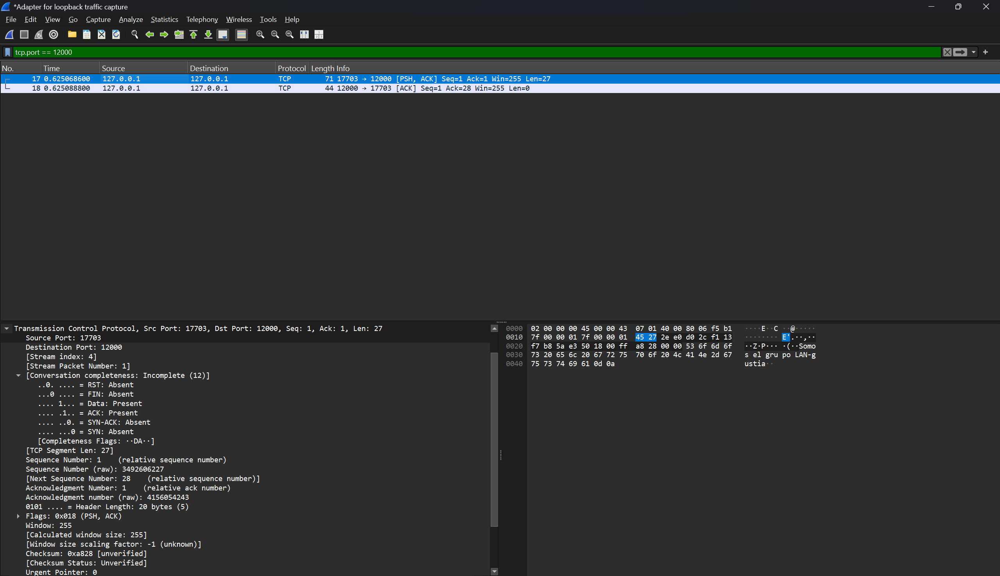

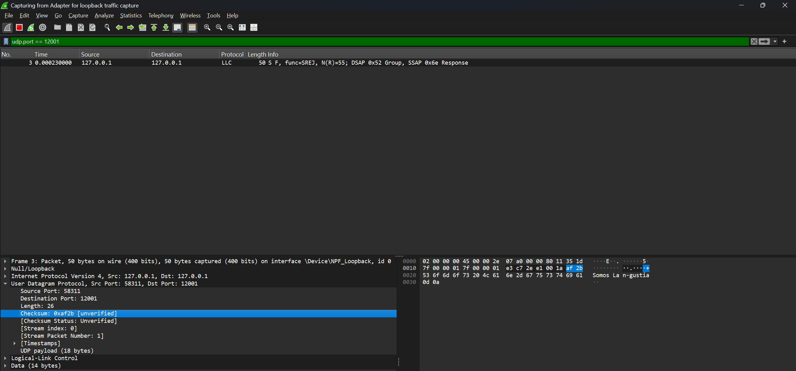

Ambos encabezados tienen puerto origen, puerto destino y checksum. El de UDP agrega solo la longitud, y ocupa 8 bytes en total. El de TCP ocupa 20 bytes y ademas tiene: número de secuencia, número de ACK, longitud del encabezado, flags, ventana y puntero urgente

## 3D

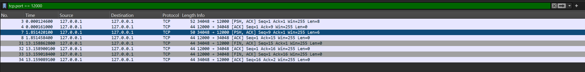

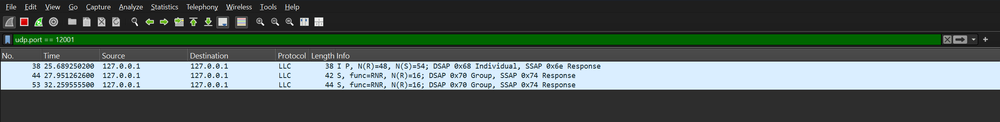

Al cerrar el cliente TCP con Ctrl+C se generaron 4 segmentos: un FIN desde cada extremo, cada uno confirmado con su ACK, y el servidor terminó al recibir el FIN del cliente. En cambio, en UDP no se envió ningún paquete, ya que no existe una conexión que cerrar, y el servidor nunca se enteró de que el cliente había terminado.

## 3E

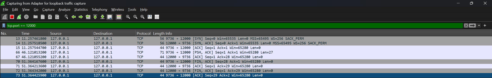

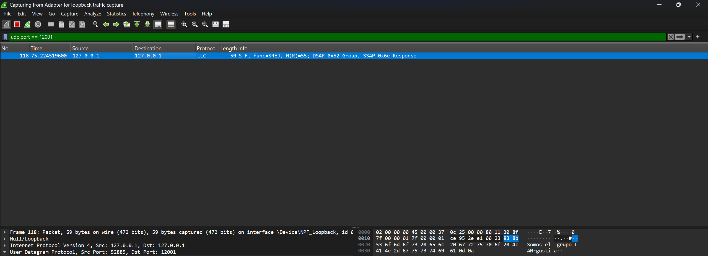

En TCP se necesitaron 9 paquetes mientras que en UDP se necesito solo 1. Con los paquetes extra compramos confiabilidad y tranquilidad de que funcionó correctamente la transmisión de los datos

## 3F

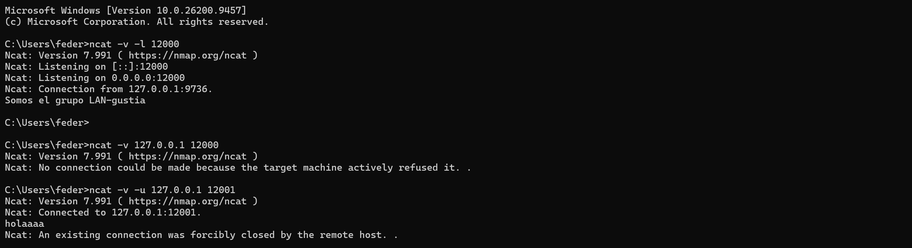

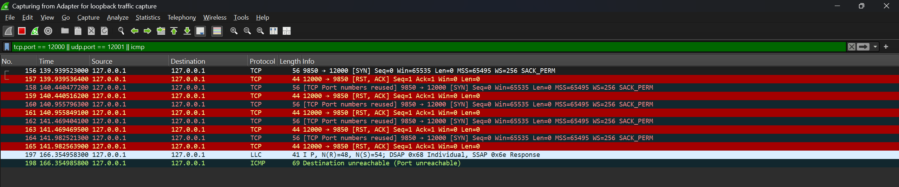

Al intentar conectarse por TCP a un puerto sin ningún proceso escuchando, el cliente mandó un SYN y el sistema respondió con un segmento RST-ACK, rechazando la conexión. Se intentó 4 veces más con el mismo resultado. En UDP, el cliente indicó que estaba conectado aunque nadie escuchaba; al enviar el datagrama, el sistema respondió con un Destino inalcanzable (Puerto inalcanzable).

## 4.A a 4.C

Inicialmente, se replicó el proceso detallado en las intrucciones del tp. Usando los scripts de python *tcp_server.py* y *tcp_client.py*, y wireshark, filtrando con *tcp.port == 12000* tendremos los siguientes resultados: 
- Ejecutando **tcp_server**

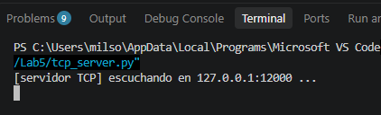

- y posteriormente **tcp_client** (en este caso el mensaje quedó por defecto)

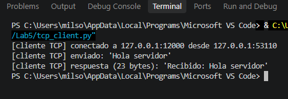

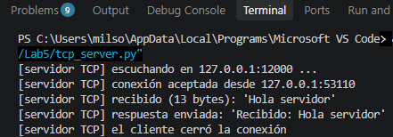

Luego, podremos ver mediante el filtrado antes mencionado que: 

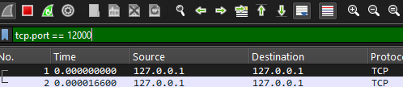

1. **Connect(): establecimiento de la conexión** 

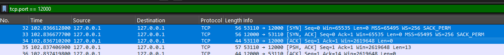

*    a. El cliente envía un segmento con el flag [SYN].
*    b. El servidor responde con [SYN, ACK].
*    c. El cliente confirma con un [ACK].

2. **Sendall(): Transferencia de datos**

A continuación podremos ver los paquetes que contienen los mensajes reales. 

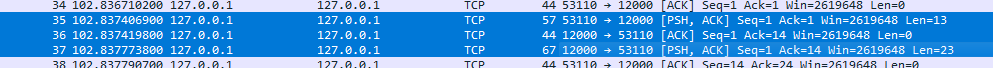

* a. Un paquete del cliente al servidor con los flags [PSH, ACK]. Acá se ve el texto "Hola servidor".

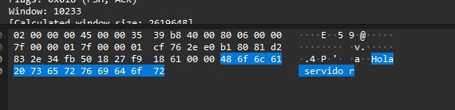

* b. Un [ACK] de respuesta del servidor (invisible en el código, lo manda el sistema operativo).

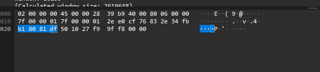

* c. Otro paquete [PSH, ACK] del servidor al cliente con la respuesta ("Recibido: Hola servidor...")

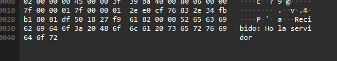

3. **Close(): cierre de la conexión**

y por último, para el proceso de cierre observamos los siguientes: 

* a. Un segmento con el flag [FIN, ACK] del cliente hacia el servidor.
* b. El servidor responde con un [ACK] y luego envía su propio [FIN, ACK].
* c. El cliente envía el [ACK] final.

## 4.D 

Con lo observado en los incisos anteriores podemos dar la siguiente información: 

| Llamada | ¿Donde se ejecuta? | ¿genera tráfico? | Segmentos que observan |
| :--- | :---: | ---: | ---: |
| socket() | Servidor y cliente | No | Ninguno. |
| bind() | servidor | No | Ninguno. |
| listen() | servidor | No | Ninguno. |
| connect() | cliente | Si | Paquetes 32, 33 y 34. Se observa el Three-way handshake inicial con la secuencia de flags [SYN] en el paquete 32, [SYN, ACK] en el 33, y la confirmación [ACK] en el 34.  |
| accept() | servidor | No | Ninguno. |
| sendall() | servidor | Si | Paquetes 35, 36, 37. Se observan los segmentos con el flag [PSH, ACK] que transportan los datos. "Hola servidor" en el paquete 35, la respuesta "Recibido: Hola servidor" en el paquete 37,  y  Un [ACK] de respuesta del servidor en el 36|
| recv() | servidor | No | Ninguno. |
| close() | ambos | Si | Paquetes 39, 40, 41 y 42. Se observa el proceso de cierre ordenado con los segmentos que llevan el flag [FIN, ACK] enviados por ambos extremos (paquetes 39 y 41), intercalados con sus respectivas confirmaciones [ACK] (paquetes 40 y 42). |
